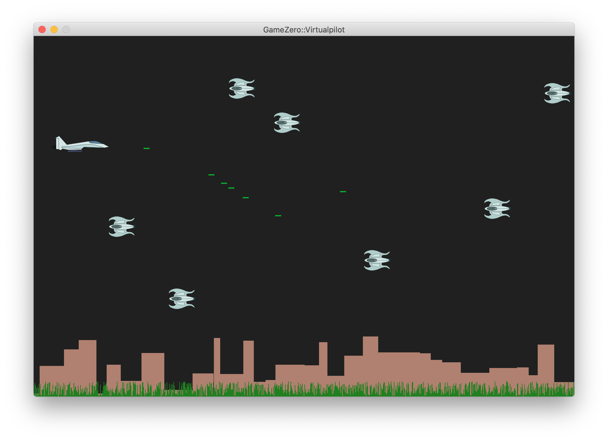

# GZRGames.jl

Suite of simple games made with [aviks/GameZero.jl](https://github.com/aviks/GameZero.jl/tree/master/src).

## Games

So far, there is only one game being developed.

**Warning:** On my Mac, the drawing was restricted to the upper left corner of the window. It seems it spawns a window with twice the given width and twice the given height. In order to compansate for that, I define the desired width and height as variables `WD` and `HT`, write the code with respect to that, but define the width and height game variables as `WIDTH = div(WD, 2)` and `HEIGHT = div(HT, 2)`. If you don't encounter this problem, just edit the game file to not divide them by two.

### Virtual Pilot

From the root directory of the repository, assuming the project has been instantiated, just run the game with

```julia
julia> using GameZero

julia> rungame("VirtualPilot/virtualpilot.jl")
```

* **Movement:** arrow keys
* **Fire:** left-shift key
* **Restart game:** Enter key



Ships were created with [Inkscape](https://inkscape.org). Sounds were obtained from [mikxkit.co - Free Game Sound Effects](https://mixkit.co/free-sound-effects/game/).
